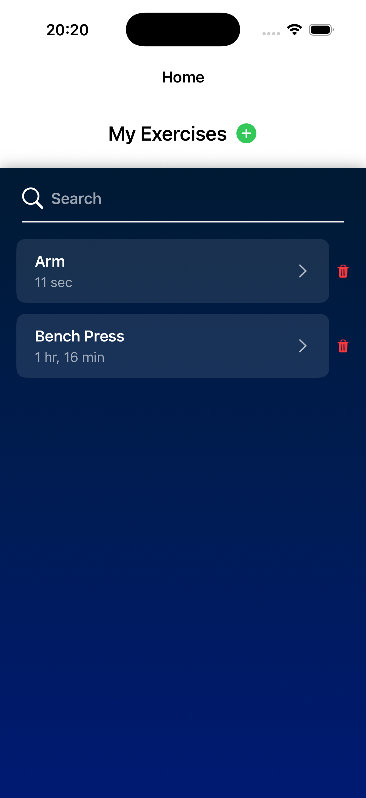
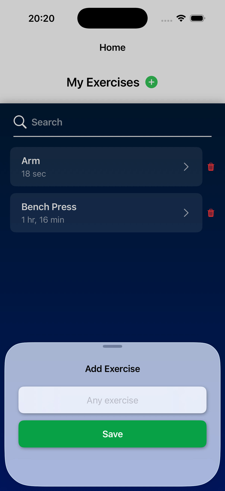
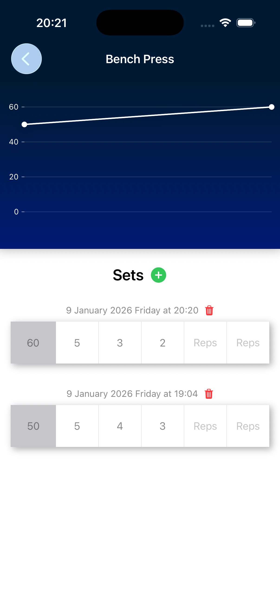

# ExerciseAppSwiftUI

A modern fitness app built with SwiftUI and SwiftData to track exercises and visualize progress.

---

## Screenshots

  
  
  

---

# Tech Stack
- SwiftUI
- Swift
- MVVM Architecture
- Swift Charts
- SwiftData

